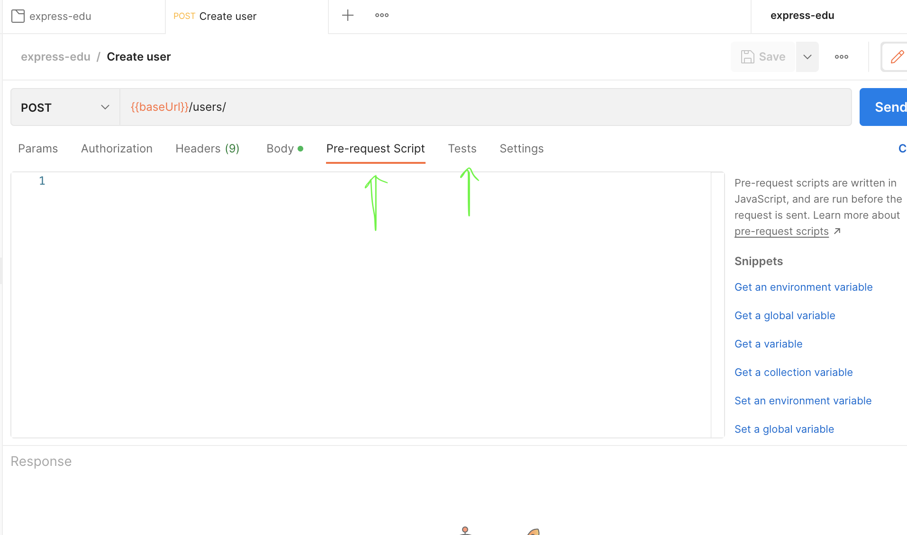

# Working with postman


## Automatization (on example of authorization)


1. Go to project name in postman, click on 3 dots (to view more action) -> edit;   

2. Go to Authorization tab and select type of authorization that should be used, add authorization data;   
\*Value can (token for example) can be taken from env variable (like `{{authToken}}` for example, instead of hard coded value).

3. On some request authorization can be "turned off" (like for login/create user requests); 

On a given request one can run js script before request is executed (using <ins>**pre-request script**</ins> tab), and run js script (for example to manipulate env variables) after request is executed (using <ins>**tests**</ins> tab) 

4. Add a script to set `authToken` to env variable on successful logic/signup. For that go to global authorization tab (see step 1 and 2) and set `{{authToken}}` as a value for auth variable. After it go to tests tab and add code like this:
```
if (pm.response.code === 200) { 
    // 201 for create user api
    pm.environment.set('authToken', pm.response.json().token)
}
``` 

